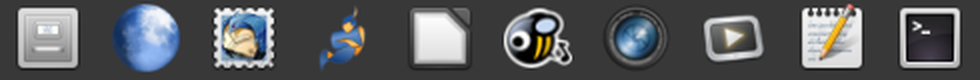

---
# Feel free to add content and custom Front Matter to this file.
# To modify the layout, see https://jekyllrb.com/docs/themes/#overriding-theme-defaults

layout: default
---

 [cd ..](https://github.com/savoury1)

---

---

## Projects

* [Ubuntu "Rolling Release" (aka Xenial or Serena or Ubuntu Enhanced)](ubuntu-rolling)

* [Métamorphose Mass File Renamer v2 (fork)](https://github.com/savoury1/metamorphose2)

* [MATE Dock Applet (fork for GTK2 desktops)](https://github.com/savoury1/mate-dock-applet)

---

## Gists

* [yman](https://gist.github.com/savoury1/bd8dc19471760ef3bc4464490f7e581c) -- Bash alias to load man pages in yelp (ie. a lovely pop-up window, easy to scroll around)

* [ccd](https://gist.github.com/savoury1/7b73ec07ca12b79f4ce6ea57f8a81f8d) -- fast change between complex paths (ie. many projects) using in-script pre-defined array

* [Timestamped prompt](https://gist.github.com/savoury1/5933e85fecd150da926e16b8d4996048) -- handy prompt with timestamp + path (line 1) then "user@host $ " (line 2)

---

